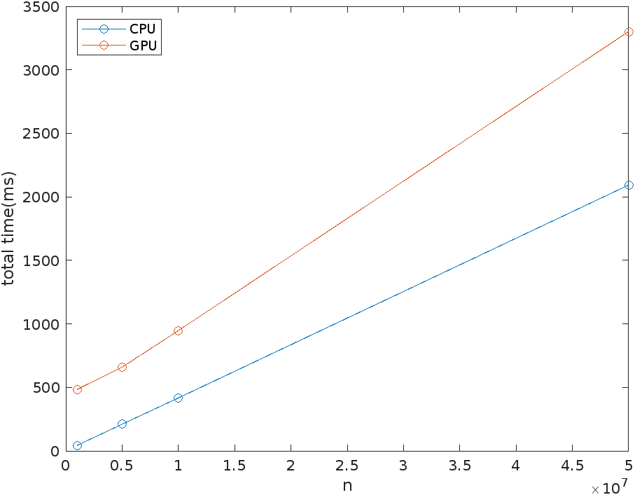
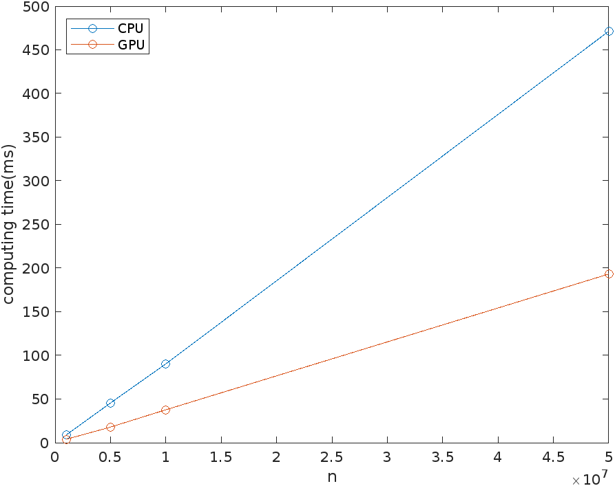

### GPU Computing Assignment

姜海天 19307110022


#### Question 1: Common Errors

##### 1.1 Pointer-1 Creates two integer pointers and sets the values to which they point to 2 and 3, respectively.

The faulty code said `int *a, b;`, which will allocate space on stack for `a` to be a pointer to `int` while `b` to be just an `int`. Then `malloc` space for `b` would not even be successfully compiled. The correct code is shown below. 

```c
void test1() { 
    int *a, *b; 
    a = (int *) malloc(sizeof(int)); 
    b = (int *) malloc(sizeof(int));

    if (!(a && b)) { 
        printf("Out of memory\n"); exit(-1); 
    }
    *a = 2;
    *b = 3;
}
```


##### 1.2 Pointer-2 Sets the value pointed to by a to an input, checks if the value pointed to by a is 0, and prints a message if it is.

Here the fault lies in the line `if(!a)`. Since `a` is a pointer of `int`, this will only judge whether `a` is a null pointer rather than whether `*a` is 0. The correct code is shown below.

```c
void test2() { 
    int *a = (int *) malloc(sizeof (int)); 
    scanf("%d", a); 
    if (!*a) printf("Value is 0\n"); 
}
```


#### Question 2: Vector addition

##### 2.1 CPU implementation

See `cpu-add.c`, binary: `cpu-add`

##### 2.2 GPU implementation

See `gpu-add.cu`, binary: `gpu-add`

##### 2.3 CPU vs GPU comparison

By running `time ./cpu-add -n num` and `time ./gpu-add -n num`, we get the total running time.

The result is:

```
num=[1e6, 5e6, 1e7, 5e7]
cpu=[43, 210, 417, 2093]  ms     4.18e-5 * num + 0.22
gpu=[484, 659, 947, 3301] ms     5.81e-5 * num + 388.58
```



This result is counter-intuitive because GPU should have done the task faster than CPU for the parallelization. So I dive deeper into what happens in each step, and I found that the more time spent by GPU is on allocating GPU memory. So I add code to calculate the computing time for each device. For GPU, the time of copying memory is contained in the computing time. This result better shows the computing power of each device. 

```
num=[1e6, 5e6, 1e7, 5e7]
gpu=[3.893, 17.908, 37.7, 193.243]  ms    3.87e-6 * num - 0.82
cpu=[8.87, 45.505, 90.266, 471.344] ms    9.46e-6 * num - 2.12
```



From the graph of pure computing time of each device, we can see that GPU is only about 2x faster than CPU on this vector addition task. So we may benefit more from the parallelization of GPU on some more complicated task like matrix multiplication. Also, the fact that allocating cuda memory itself may take a long time tells us that we should try to reuse the allocated memory on GPU as possible to avoid such unnecessary overhead. 